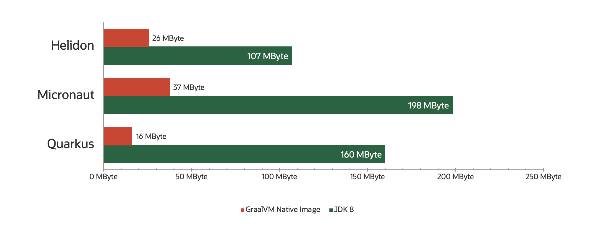
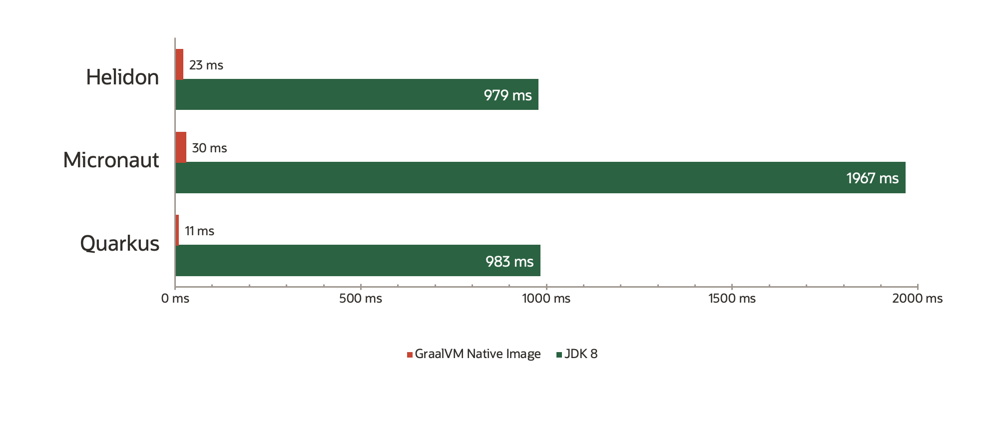

# GraalVM Native Image

## What is Native Image

- Diagram of process: build an image => exe
- The model of build time vs runtime inititialisation

## Benefits - Runtime Advantages
   
Native Image has some very important benefits:

- Memory: 

    GraalVM Native Image allows you to reduce the memory consumption of your Java applications

    

- Startup Time:

    GraalVM Native Image allows for near instantaneous start time times for Java micro-service applications

    

- Reduction in Package Size:

    Packaging applications as Native Images significanlty reduces the size of the resultant app / containers. We can all use tools, such as `upx` to compress the native image even more. In this workshiop we will look at how much we can reduce the packaged size of a Java micro-service by using Native Image

- Security:

    There is less in a packaged Native Image and therefore less of an attack surface. We believe that this leads to improved security

## Things to be Aware of

Be aware, though, that Native Image is a different technology from the JVM. The benefits that native image offers, in part arise from some of the assumptions that it is built on and it is important to understand these, If you stick to building new apps using a framework that is designed to target Native Image, you will not often hit issues, though you may still do if you import a Java library that doesn't play well with Native Image. This is where it is important to understand what is happening inside.

A very rough overview of some of the limitations of Native Image are listed [here : Natve Image Limitations & Unsupported Features](./native-image-limitations.md).

Most limitations can be worked around and this is something that we will see as we step through the various parts of this workshop.

## Want to use Native Image? Use a Framework
Use a framework, as these are designed to ease the path:

- [Micronaut](https://micronaut.io/)
- [Helidon](https://helidon.io/#/)
- [Spring Boot](https://github.com/spring-projects-experimental/spring-graalvm-native)
- [Picocli](https://picocli.info/)
- [Quarkus](https://quarkus.io/)

---

